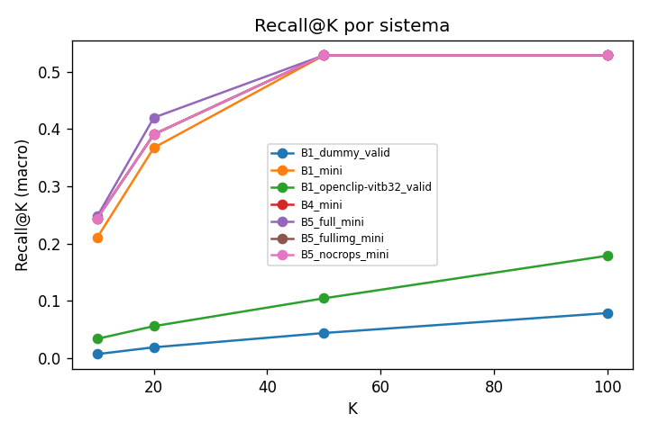

# Instrument Retrieval Lab — Informe de resultados

## 1. Objetivo
Recuperación visual de instrumentos tradicionales portugueses: dada una query textual, ordenar las
imágenes que contienen el instrumento, sin usar nombres de archivo, rutas ni etiquetas en inferencia.

## 2. Dataset
22 instrumentos (categoría paraguas excluida), splits train/valid/test, ground truth COCO
multi-etiqueta. DOI Mendeley 10.17632/pk7txkgt4v.2.

## 3. Prevención de fuga
image_id anónimos, mapping privado, prompts/traces sin filename/vimeo/labels. Tests automáticos.

## 4. Métodos
B1 dense global · B3 late-interaction (ColQwen) · B4 dense+VLM reranker · B5 dense+agente determinista.

## 5. Resultados (macro por instrumento)

| system | recall@20 | recall@50 | recall@100 | ndcg@10 | ndcg@100 | map | mrr |
|---|---|---|---|---|---|---|---|
| B1_dummy_valid | 0.0190 | 0.0439 | 0.0787 | 0.0762 | 0.0942 | 0.0093 | 0.2004 |
| B1_mini | 0.3673 | 0.5287 | 0.5287 | 0.5568 | 0.5249 | 0.3614 | 0.7153 |
| B1_openclip-vitb32_valid | 0.0559 | 0.1045 | 0.1787 | 0.1867 | 0.2233 | 0.0659 | 0.2927 |
| B1_openclip-vitb32_valid__rerankmetrics | — | — | — | — | — | — | — |
| B4_mini | 0.3907 | 0.5287 | 0.5287 | 0.6032 | 0.5669 | 0.3955 | 0.8667 |
| B4_mini__rerankmetrics | — | — | — | — | — | — | — |
| B5_full_mini | 0.4199 | 0.5287 | 0.5287 | 0.6225 | 0.5836 | 0.4175 | 0.9167 |
| B5_full_mini__rerankmetrics | — | — | — | — | — | — | — |
| B5_fullimg_mini | 0.3907 | 0.5287 | 0.5287 | 0.6032 | 0.5669 | 0.3955 | 0.8667 |
| B5_nocrops_mini | 0.3907 | 0.5287 | 0.5287 | 0.6032 | 0.5669 | 0.3955 | 0.8667 |

## 6. Resultados por instrumento (Recall@100)

| instrument | B1_dummy_valid | B1_mini | B1_openclip-vitb32_valid | B4_mini | B5_full_mini | B5_fullimg_mini | B5_nocrops_mini | best |
|---|---|---|---|---|---|---|---|---|
| adufe | 0.101 | 0.133 | 0.065 | 0.133 | 0.133 | 0.133 | 0.133 | B1_mini |
| bombos | 0.063 | — | 0.183 | — | — | — | — | B1_openclip-vitb32_valid |
| caixa-tamboril | 0.061 | — | 0.210 | — | — | — | — | B1_openclip-vitb32_valid |
| castanholas | 0.061 | — | 0.000 | — | — | — | — | B1_dummy_valid |
| cavaquinho | 0.077 | 0.500 | 0.062 | 0.500 | 0.500 | 0.500 | 0.500 | B1_mini |
| concertina | 0.079 | 0.771 | 0.432 | 0.771 | 0.771 | 0.771 | 0.771 | B1_mini |
| ferrinhos-triangulo | 0.026 | — | 0.269 | — | — | — | — | B1_openclip-vitb32_valid |
| flauta | 0.072 | — | 0.105 | — | — | — | — | B1_openclip-vitb32_valid |
| gaita-de-foles | 0.064 | 0.429 | 0.196 | 0.429 | 0.429 | 0.429 | 0.429 | B1_mini |
| guitarra-portuguesa | 0.087 | 0.700 | 0.118 | 0.700 | 0.700 | 0.700 | 0.700 | B1_mini |
| matracas | 0.100 | — | 0.200 | — | — | — | — | B1_openclip-vitb32_valid |
| palheta | 0.167 | — | 0.000 | — | — | — | — | B1_dummy_valid |
| rabeca-chuleira | 0.096 | — | 0.105 | — | — | — | — | B1_openclip-vitb32_valid |
| reque-reque | 0.042 | — | 0.042 | — | — | — | — | B1_dummy_valid |
| sarronca | 0.033 | — | 0.533 | — | — | — | — | B1_openclip-vitb32_valid |
| viola-amarantina | 0.053 | — | 0.129 | — | — | — | — | B1_openclip-vitb32_valid |
| viola-beiroa | 0.051 | — | 0.615 | — | — | — | — | B1_openclip-vitb32_valid |
| viola-braguesa | 0.089 | — | 0.083 | — | — | — | — | B1_dummy_valid |
| viola-campanica | 0.089 | — | 0.120 | — | — | — | — | B1_openclip-vitb32_valid |
| viola-de-arame | 0.065 | — | 0.376 | — | — | — | — | B1_openclip-vitb32_valid |
| viola-toeira | 0.182 | — | 0.000 | — | — | — | — | B1_dummy_valid |
| violao | 0.074 | 0.639 | 0.087 | 0.639 | 0.639 | 0.639 | 0.639 | B1_mini |

## 7. Significancia estadística (gain vs baseline, Recall@100)

_(sin pares comparables)_

## 8. Sistemas evaluados

10 runs en `outputs/metrics`.

## 9. Limitaciones
- Modelos fundacionales pueden conocer instrumentos comunes.
- ~22 clases → potencia estadística limitada; CIs anchos.
- B4/B5 dependen del recall inicial del dense (oracle_recall@N).
