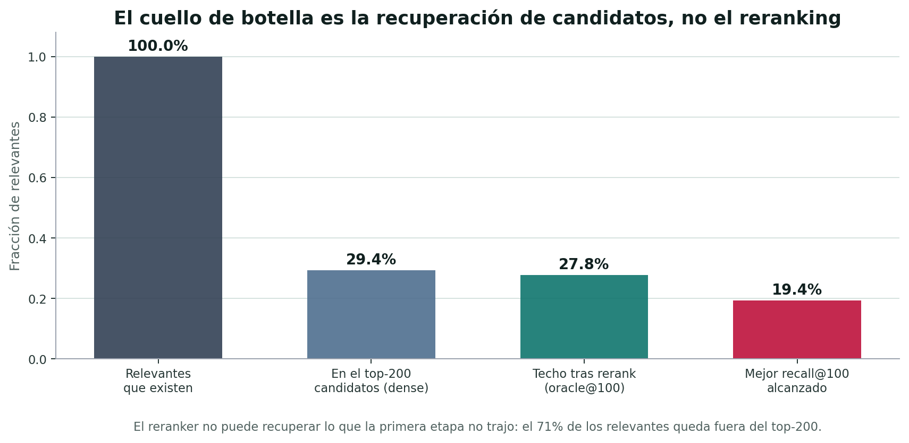

# Multimodal Visual Retrieval of Traditional Portuguese Musical Instruments

Dense, VLM, and Agentic Reranking — a reproducible comparison on a labelled visual corpus.

Adrian Valera Roman · Álvaro Lozano Murciego 
adrianvalrom.usal@usal.es · loza@usal.es

---

## Índice de contenidos

1. Motivación y formulación como recuperación visual
2. Corpus anotado y control de fugas de información
3. Sistemas evaluados e hipótesis de investigación
4. Diseño experimental y reproducibilidad
5. Resultados: recall, calidad y **significancia estadística**
6. Techo de candidatos y ablaciones
7. Análisis por instrumento, coste y limitaciones
8. Conclusiones y futuras líneas de trabajo

Estructura revisada: se añaden significancia estadística, techo de candidatos, ablaciones, análisis por instrumento y limitaciones.

---

## Motivación

La recuperación de información permite explorar grandes corpus culturales sin revisar manualmente cada vídeo, imagen o documento. En archivos audiovisuales, una consulta útil no suele ser un identificador técnico, sino una necesidad semántica:

Encontrar fragmentos visuales donde aparece un instrumento tradicional concreto, aunque el vídeo no esté etiquetado con ese instrumento.

El mapa de A Música Portuguesa a Gostar Dela Própria reúne numerosos vídeos de música tradicional portuguesa. En ese tipo de archivo, la pregunta de IR sería: dado un instrumento, ¿qué frames o vídeos deberían aparecer primero?

---

## Del archivo al corpus evaluable

El punto de partida es un archivo audiovisual amplio: actuaciones, entrevistas, bailes, grabaciones de campo y vídeos con instrumentos en contextos muy variables.

Para evaluar sistemas de recuperación no basta con tener vídeos: se necesita ground truth. Por eso se etiquetó un dataset visual y se publicó como:

Comprehensive dataset of Portuguese folk instruments for computer vision and heritage research 
Data in Brief 61, 2025. DOI 10.1016/j.dib.2025.111739 
Dataset: Mendeley DOI 10.17632/pk7txkgt4v.2

  
  

---

## Dataset

  

    
Train

    
3,954

    
imágenes

  

  

    
Valid

    
1,351

    
imágenes

  

  

    
Test

    
1,317

    
imágenes

  

  

    
Clases

    
22

    
instrumentos

  

Cada imagen puede contener varios instrumentos. Esto convierte el problema en recuperación multi-etiqueta: una imagen es relevante para una consulta si el instrumento aparece visualmente en el frame.

  

---

## Caso de estudio: formulación IR

El caso de estudio se plantea como una tarea clásica de recuperación:

- Consulta: nombre textual de un instrumento, en portugués, español o inglés.
- Documento: una imagen, normalmente un frame extraído de un vídeo.
- Relevancia: el instrumento consultado aparece en la imagen.
- Salida: ranking de imágenes ordenadas por probabilidad de relevancia.

Esto permite comparar sistemas con métricas IR estándar: Recall@K, nDCG@K, mAP y MRR.

Escala del test: 22 instrumentos × 3 idiomas = 66 consultas. n reducido → los intervalos de confianza serán anchos (lo verificamos en Resultados).

---

## Control de fuga de información

La entrada disponible para los modelos es solo visual: consulta textual + imagen del frame. Los nombres de archivo, IDs de vídeo (Vimeo) y etiquetas del dataset no se exponen durante la inferencia; solo se usan después, para construir qrels y métricas.

Garantías metodológicas (verificadas con tests automáticos):

- `image_id` anónimo; mapping privado nunca usado en inferencia.
- Prompts y trazas saneados de filename / ruta / clase ground truth.
- Modo offline: sin internet ni búsqueda web durante el reranking.

  
Consulta <strong>“adufe”</strong>

  
→

  
Frame <strong>imagen</strong>

  
→

  
Modelo <strong>score</strong>

  
→

  
Ranking <strong>image_id</strong>

---

## Setup experimental y reproducibilidad

Slide nuevo: condiciones exactas del experimento para reproducibilidad.

  

Split de evaluación

test — 1,317 imágenes, 66 consultas

  

Dense base (candidatos)

OpenCLIP ViT-L/14

  

Determinismo

seed = 42 · temperature = 0.0

  

Profundidad de candidatos

top-200 (B4/B5) · top-100 (Qwen3.6)

  

Serving VLM

vLLM (Qwen2.5-VL-3B) · llama.cpp (Qwen3.6-27B)

  

Reproducibilidad

Docker GPU · git commit · DVC · MLflow

Modo desarrollo (valid) para elegir modelo, prompts y umbrales; modo final (test) solo para métricas. No se ajusta nada tras mirar test.

---

## Sistemas evaluados

Cuatro familias: Dense (embeddings globales), Late-interaction, VLM-rerank multimodal y búsqueda Agéntica.
Códigos internos: B1 / B3 / B4 / B5 (B2 = baseline textual BM25, descartado por diseño: el corpus se trata como puramente visual).

---

## Dense retrieval (B1)

Los modelos densos proyectan la consulta y cada imagen a un espacio vectorial común. El ranking se obtiene por similitud entre vectores.

- Un embedding por consulta, un embedding por imagen.
- Muy eficiente para indexar y recuperar a gran escala.
- Limitación: puede perder detalles pequeños o instrumentos visualmente parecidos.

Sistemas evaluados: OpenCLIP ViT-B/32, OpenCLIP ViT-L/14 y JinaCLIP.

---

## Late-interaction (B3)

ColQwen representa la imagen y la consulta mediante múltiples vectores. En lugar de comparar un único embedding global, calcula coincidencias entre tokens visuales y textuales (late interaction).

- Mejor sensibilidad a partes locales de la imagen.
- Útil cuando el instrumento ocupa una zona pequeña.
- Más costoso que un índice denso global.

Especialmente interesante para instrumentos que aparecen parcialmente o entre otros objetos.

---

## VLM-rerank (B4)

El reranking multimodal parte de una lista candidata generada por recuperación densa. Un VLM examina cada imagen candidata y decide si el instrumento está presente.

- El VLM no busca en todo el corpus: solo reordena candidatos.
- Produce una decisión y una confianza (JSON cerrado, `temperature=0`).
- Modelo base: Qwen2.5-VL-3B; se compara además con Qwen3.6-27B.

La calidad final está acotada por el techo de los candidatos recuperados inicialmente.

---

## Búsqueda agéntica (B5)

Añade una estrategia de inspección visual sobre el reranking, como grafo determinista propio (no un agente libre):

- Primero pregunta por la imagen completa.
- Si hay incertidumbre, genera recortes deterministas.
- Puede producir una breve descripción (caption).
- Fusiona evidencias para el score final.

El objetivo es mirar de forma controlada cuando la imagen completa no basta.

---

## Hipótesis de investigación

Slide nuevo: enmarca las hipótesis del ADR §3 y adelanta el veredicto (detalle en Resultados).

  

    no confirmada 
    <strong>H1 · Dense global</strong> recupera sin entrenamiento, pero falla en instrumentos pequeños o parecidos.
  

  

    refutada 
    <strong>H2 · Late-interaction</strong> mejora sobre dense global. → No en promedio (Δ no significativo).
  

  

    matizada 
    <strong>H3 · VLM-rerank</strong> mejora el ranking. → Solo con un VLM <em>grande</em>, y solo la ordenación.
  

  

    refutada 
    <strong>H4 · Agéntico</strong> mejora sobre una sola llamada VLM. → Captions inútiles; crops solo un margen no significativo.
  

---

## Diseño experimental

La evaluación compara sistemas sobre las mismas consultas y el mismo split de test:

- 22 instrumentos · 3 idiomas · 66 consultas.
- Mismo dense base (OpenCLIP L/14) para todos los rerankers.
- Métricas macro por consulta/instrumento.

El protocolo separa dos fases:

- Recuperación inicial: ranking directo sobre el corpus.
- Reranking: reordenación de candidatos ya recuperados.

Esto distingue entre capacidad de <em>encontrar</em> candidatos y capacidad de <em>ordenar</em> los encontrados.

---

## Resultados: Recall@K

JinaCLIP lidera Recall@100 (0.194) pero sin diferencia significativa (IC 95% solapados, n=66). Qwen3.6 no añade recall: topa en el techo del denso (0.181).

---

## Resultados: tabla macro (test)

Slide nuevo: los números detrás de las figuras. Mejor por columna en negrita.

| Sistema (código) | R@20 | R@50 | R@100 | nDCG@10 | nDCG@100 | mAP | MRR |
|---|---|---|---|---|---|---|---|
| OpenCLIP B/32 (B1) | 0.024 | 0.078 | 0.148 | 0.156 | 0.201 | 0.051 | 0.225 |
| OpenCLIP L/14 (B1) | 0.053 | 0.105 | 0.181 | 0.250 | 0.246 | 0.076 | 0.344 |
| JinaCLIP (B1) | 0.047 | **0.114** | **0.194** | 0.252 | 0.264 | 0.084 | 0.328 |
| ColQwen (B3) | 0.033 | 0.087 | 0.162 | 0.197 | 0.227 | 0.070 | 0.304 |
| VLM-rerank 3B (B4) | 0.042 | 0.103 | 0.190 | 0.260 | 0.255 | 0.076 | 0.378 |
| Agéntico (B5) | 0.046 | 0.109 | 0.193 | 0.262 | 0.264 | 0.080 | 0.423 |
| **Qwen3.6-27B (B4·27B)** | **0.063** | 0.111 | 0.181 | **0.389** | **0.272** | **0.088** | **0.495** |

Diferencias pequeñas (~0.01–0.02) sobre 66 consultas: requieren test de significancia (siguiente slide).

---

## Resultados: calidad del ranking

Barras = IC 95%. Solo Qwen3.6-27B (rojo) se separa en nDCG@10 y MRR; el resto solapan entre sí ⇒ no significativo.

---

## Significancia estadística

Slide nuevo (ADR §6.4/§18.3): bootstrap 95% CI + test de permutación pareado, corrección Holm. n=66.

| Comparación (delta) | nDCG@10 | mAP | MRR | Recall@100 |
|---|---|---|---|---|
| JinaCLIP vs OpenCLIP L/14 | +0.002 | +0.008 | −0.016 | +0.013 |
| ColQwen vs OpenCLIP L/14 | −0.053 | −0.006 | −0.039 | −0.019 |
| VLM-rerank 3B vs OpenCLIP L/14 | +0.010 | +0.000 | +0.034 | +0.010 |
| Agéntico vs VLM-rerank 3B | +0.002 | +0.003 | +0.045 | +0.002 |
| **Qwen3.6-27B vs OpenCLIP L/14** | **+0.138 ✅** | **+0.012 ✅** | **+0.151 ✅** | +0.000 |
| **Qwen3.6-27B vs VLM-rerank 3B** | **+0.128 ✅** | **+0.012 ✅** | **+0.118 ✅** | −0.010 |

✅ = significativo (Holm dentro de cada métrica, m=6, p&lt;0.05). <strong>Solo 7 de 30 comparaciones lo son, y todas son del VLM grande.</strong> Entre dense, late-interaction, VLM pequeño y agéntico: ninguna diferencia es significativa.

Nota: la fila 27B vs 3B mezcla tamaño y profundidad de candidatos (top-100 vs top-200); la comparación limpia es 27B vs dense base, también significativa.

---

## Techo de candidatos

Solo el 29% de los relevantes entra en el top-200 (oracle 27.8%). El reranker no recupera lo que la etapa 1 no trajo: el cuello de botella es la recuperación, no el VLM.

---

## Ablaciones de la búsqueda agéntica

Slide nuevo: ablación por componente. Aislamos crops y captions quitándolos uno a uno.

| Variante | Recall@100 | nDCG@100 | mAP | MRR |
|---|---|---|---|---|
| VLM pointwise (sin agente) | 0.190 | 0.255 | 0.076 | 0.378 |
| Agéntico completo (crops + caption) | 0.193 | 0.264 | 0.080 | 0.423 |
| Agéntico **sin captions** | 0.193 | 0.264 | 0.080 | 0.423 |
| Agéntico **sin crops** | 0.190 | 0.255 | 0.076 | 0.378 |

Quitar los <strong>captions</strong> no cambia nada (idéntico al completo) → los captions son inútiles. Quitar los <strong>crops</strong> colapsa el sistema al VLM pointwise → los crops son el único componente con efecto, pero marginal y no significativo (MRR +0.045, recall +0.002; p&gt;0.05).

---

## Lectura de los resultados

| Enfoque | Lectura principal (corregida) |
|---|---|
| Dense retrieval | Base sólida y barata; lidera Recall@100/mAP en punto estimado, sin ventaja significativa. |
| Late interaction | No mejora sobre dense en promedio (Δ negativo, no significativo). |
| VLM-rerank 3B | Sube MRR/nDCG en punto estimado, pero ninguna mejora es significativa. |
| Qwen3.6-27B | Único con mejoras significativas en nDCG@10, mAP y MRR; no añade recall. |
| Agéntico | Captions inútiles; crops solo un margen no significativo; más coste. |

El cuello de botella no es el razonamiento visual, sino que la primera etapa recupere suficientes candidatos relevantes.

---

## Análisis por instrumento

Slide nuevo: la media macro esconde una varianza enorme entre clases.

<strong>Recall@100 por clase (test):</strong>

- Fáciles: viola-beiroa 0.76, concertina 0.49, caixa-tamboril 0.38.
- Difíciles: violão 0.08, viola-braguesa 0.13.
- Fallo total (0.00 en todos los sistemas): matracas, palheta, sarronca, reque-reque.

Ningún sistema domina: el mejor por clase se reparte entre dense, late-interaction, VLM-rerank y agéntico.

<strong>Error analysis (ej. adufe):</strong>

- 8 falsos positivos en top-100.
- 150 relevantes no recuperados (fuera del top-100).

Coherente con el techo de candidatos: la mayoría de errores son de cobertura, no de ordenación.

---

## Coste temporal por consulta

La comparación temporal debe leerse como parte del diseño del sistema:

- OpenCLIP L/14: 0.019 s/consulta; JinaCLIP: 0.104 s/consulta.
- ColQwen: 0.479 s/consulta con embeddings cacheados.
- VLM-rerank 3B: 30.1 s/consulta; agéntico: 44.9 s/consulta.
- Qwen3.6-27B: 129.3 s/consulta incremental (candidatos 51-100).

El reranking cuesta ~1,600–2,500× más que el dense para una mejora de ordenación acotada por el techo. Latencias de Qwen3.6 estimadas desde timestamps y en serving distinto (llama.cpp): no comparables 1:1.

---

## Limitaciones y amenazas a la validez

Slide nuevo (ADR §22).

- <strong>Potencia estadística baja</strong>: 66 consultas → IC 95% anchos; casi ninguna diferencia alcanza significancia.
- <strong>Conocimiento previo</strong>: los modelos fundacionales pueden haber visto instrumentos comunes; se prioriza open-weight y ejecución offline para acotarlo.
- <strong>Techo de la primera etapa</strong>: los rerankers no recuperan positivos fuera del top-N inicial.
- <strong>Confound Qwen3.6</strong>: distinto tamaño (27B vs 3B), profundidad (top-100 vs top-200) y serving; su ventaja mezcla esos factores.
- <strong>Coste del agéntico</strong>: no compensa cuando el VLM-rerank simple ya agota el margen disponible.

---

## Conclusiones

Conclusiones reescritas para reflejar la significancia estadística.

1. Con n=66, solo un VLM grande (Qwen3.6-27B) produce mejoras de ordenación estadísticamente significativas (nDCG@10 +0.14, mAP +0.012, MRR +0.15; Holm p&lt;0.05).
2. Ningún sistema mejora el recall: todos topan en el techo del candidato denso (~29% en top-200). El cuello de botella es la recuperación inicial.
3. Entre dense, late-interaction, VLM pequeño y agéntico, las diferencias no son significativas: el dense, barato, es una elección defendible.
4. Los captions no cambian la métrica; los crops solo un margen no significativo (ablación).
5. El coste crece hasta ~2,500× para una mejora acotada por el techo: el mejor ranking no es el más operativo.

---

## Futuras líneas de trabajo

- Mejorar la primera etapa (el verdadero cuello de botella): dense fine-tuning o fusión de retrievers para subir el techo de candidatos.
- Escalar Qwen3.6-27B a top-200 y bajo el mismo entorno GPU/serving para separar calidad del modelo, profundidad y coste.
- Medir latencia completa por query para todos los enfoques con cachés y hardware controlados.
- Llevar la evaluación de frames a recuperación de vídeos completos.
- Integrar señales temporales: múltiples frames, audio y contexto de actuación.
- Aumentar el número de consultas para ganar potencia estadística.

---

## Bibliografía

[1] A Música Portuguesa a Gostar Dela Própria, “Mapa,” accessed Jun. 30, 2026. [Online]. Available: https://amusicaportuguesaagostardelapropria.org/map

[2] N. Zendron <em>et al.</em>, “Comprehensive dataset of Portuguese folk instruments for computer vision and heritage research,” <em>Data in Brief</em>, vol. 61, Art. no. 111739, 2025, doi: 10.1016/j.dib.2025.111739.

[3] N. Zendron <em>et al.</em>, “Portuguese folk instruments dataset,” Mendeley Data, V2, 2025, doi: 10.17632/pk7txkgt4v.2.

[4] A. Radford <em>et al.</em>, “Learning transferable visual models from natural language supervision,” in <em>Proc. ICML</em>, 2021.

[5] G. Ilharco, M. Wortsman, R. Wightman, C. Gordon, N. Carlini, R. Taori, A. Dave, V. Shankar, H. Namkoong, J. Miller, H. Hajishirzi, A. Farhadi, and L. Schmidt, “OpenCLIP,” Zenodo, 2021, doi: 10.5281/zenodo.5143773.

[6] Jina AI, “Jina CLIP: Your CLIP model is also your text retriever,” arXiv:2405.20204, 2024.

[7] M. Faysse <em>et al.</em>, “ColPali: Efficient document retrieval with vision language models,” arXiv:2407.01449, 2024.

[8] P. Wang <em>et al.</em>, “Qwen2-VL: Enhancing vision-language model's perception of the world at any resolution,” arXiv:2409.12191, 2024.

[9] Qwen Team, “Qwen2.5-VL technical report,” arXiv:2502.13923, 2025.

[10] T. Yao <em>et al.</em>, “ReAct: Synergizing reasoning and acting in language models,” in <em>Proc. ICLR</em>, 2023.

[11] G. Gerganov, “llama.cpp,” GitHub repository, 2023. [Online]. Available: https://github.com/ggml-org/llama.cpp

[12] Unsloth, “Qwen3.6-27B-GGUF,” Hugging Face model card, accessed Jun. 30, 2026. [Online]. Available: https://huggingface.co/unsloth/Qwen3.6-27B-GGUF

