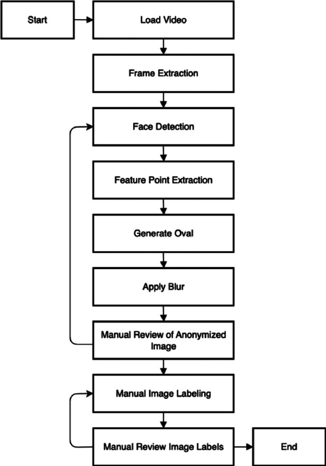
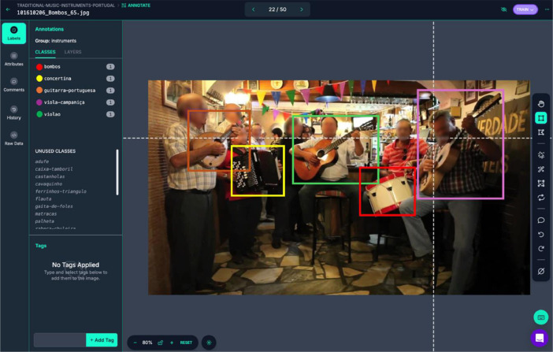
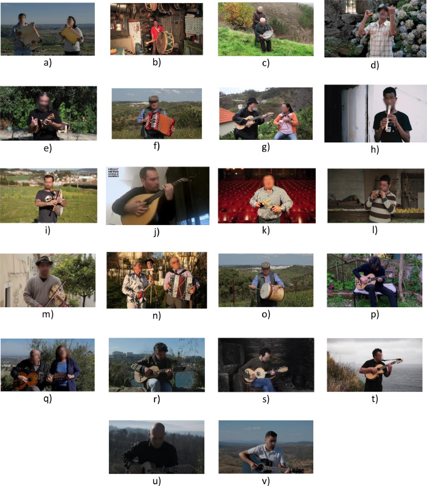
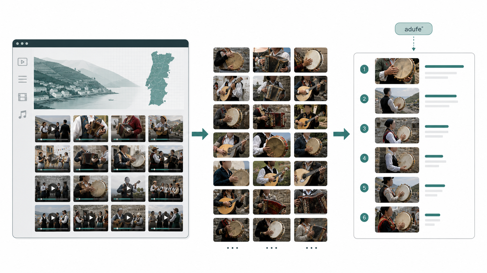
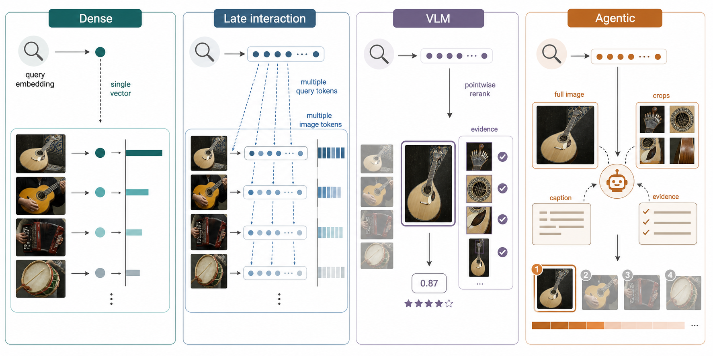
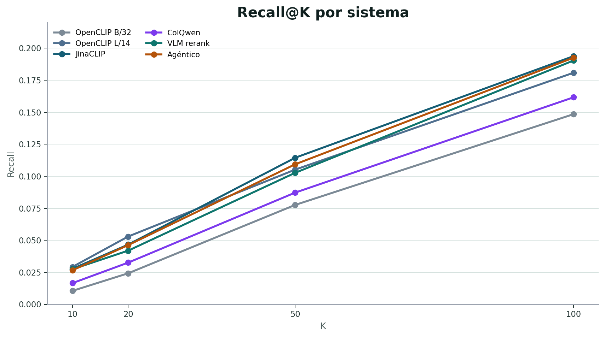
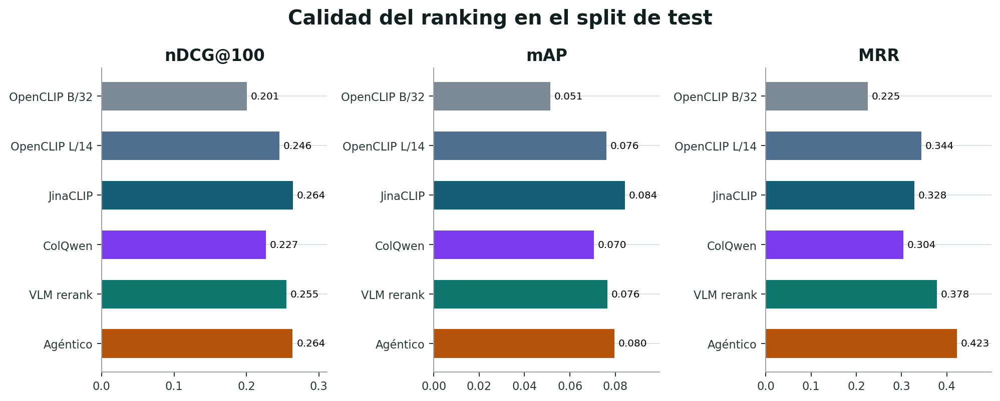
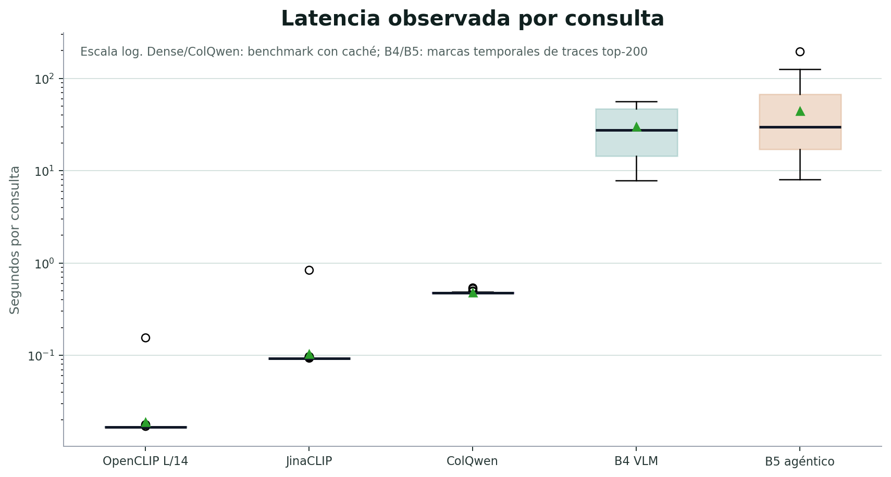

# Visual Information Retrieval for Traditional Portuguese Instruments

Evaluating dense, late-interaction, multimodal and agentic retrieval systems on a labelled visual corpus.

Adrian Valera Roman

---

## Índice de contenidos

1. Motivación: recuperación de información en archivos audiovisuales
2. Corpus anotado y formulación del caso de estudio
3. Sistemas evaluados
4. Resultados de recuperación y reranking
5. Coste temporal por consulta
6. Conclusiones y futuras líneas de trabajo

---

## Motivación

La recuperación de información permite explorar grandes corpus culturales sin revisar manualmente cada vídeo, imagen o documento. En archivos audiovisuales, una consulta útil no suele ser un identificador técnico, sino una necesidad semántica:

Encontrar fragmentos visuales donde aparece un instrumento tradicional concreto, aunque el vídeo no esté etiquetado con ese instrumento.

El mapa de A Música Portuguesa a Gostar Dela Própria reúne numerosos vídeos de música tradicional portuguesa. En ese tipo de archivo, la pregunta de IR sería: dado un instrumento, ¿qué frames o vídeos deberían aparecer primero?

---

## Del archivo al corpus evaluable

El punto de partida es un archivo audiovisual amplio: actuaciones, entrevistas, bailes, grabaciones de campo y vídeos con instrumentos en contextos muy variables.

Para evaluar sistemas de recuperación no basta con tener vídeos: se necesita ground truth. Por eso se etiquetó un dataset visual y se publicó como:

Comprehensive dataset of Portuguese folk instruments for computer vision and heritage research 
Data in Brief 61, 2025. DOI 10.1016/j.dib.2025.111739 
Dataset: Mendeley DOI 10.17632/pk7txkgt4v.2

  
  

---

## Dataset

  

    
Train

    
3,954

    
imágenes

  

  

    
Valid

    
1,351

    
imágenes

  

  

    
Test

    
1,317

    
imágenes

  

  

    
Clases

    
22

    
instrumentos

  

Cada imagen puede contener varios instrumentos. Esto convierte el problema en recuperación multi-etiqueta: una imagen es relevante para una consulta si el instrumento aparece visualmente en el frame.

  

---

## Caso de estudio: formulación IR

El caso de estudio se plantea como una tarea clásica de recuperación:

- Consulta: nombre textual de un instrumento, en portugués, español o inglés.
- Documento: una imagen, normalmente un frame extraído de un vídeo.
- Relevancia: el instrumento consultado aparece en la imagen.
- Salida: ranking de imágenes ordenadas por probabilidad de relevancia.

Esto permite comparar sistemas con métricas IR estándar: Recall@K, nDCG@K, mAP y MRR.

---

## Relevancia y control de información

La entrada disponible para los modelos es solo visual:

Consulta textual + imagen del frame.

Los nombres de archivo, identificadores de vídeo y etiquetas del dataset no se exponen durante la inferencia. Solo se usan después, para construir qrels y calcular métricas.

  
Consulta <strong>“adufe”</strong>

  
→

  
Frame <strong>imagen</strong>

  
→

  
Modelo <strong>score</strong>

  
→

  
Ranking <strong>image_id</strong>

---

## Sistemas evaluados

Cuatro familias de aproximaciones: embeddings globales, interacción tardía, reranking multimodal y búsqueda agéntica.

---

## Sistema 1: recuperación densa

Los modelos densos proyectan la consulta y cada imagen a un espacio vectorial común. El ranking se obtiene por similitud entre vectores.

- Un embedding por consulta.
- Un embedding por imagen.
- Muy eficiente para indexar y recuperar a gran escala.
- Limitación: puede perder detalles pequeños o instrumentos visualmente parecidos.

Sistemas evaluados: OpenCLIP ViT-B/32, OpenCLIP ViT-L/14 y JinaCLIP.

---

## Sistema 2: interacción tardía

ColQwen representa la imagen y la consulta mediante múltiples vectores. En lugar de comparar un único embedding global, calcula coincidencias entre tokens visuales y textuales.

- Mejor sensibilidad a partes locales de la imagen.
- Útil cuando el instrumento ocupa una zona pequeña.
- Más costoso que un índice denso global.

Este enfoque es especialmente interesante para instrumentos que aparecen parcialmente o entre otros objetos visuales.

---

## Sistema 3: reranking multimodal

El reranking multimodal parte de una lista candidata generada por recuperación densa. Después, un VLM examina cada imagen candidata y decide si el instrumento está presente.

- El VLM no busca en todo el corpus: solo reordena candidatos.
- Produce una decisión y una confianza.
- Puede incorporar evidencia visual explícita.

La calidad final depende del techo impuesto por los candidatos recuperados inicialmente.

---

## Sistema 4: búsqueda agéntica

La búsqueda agéntica añade una estrategia de inspección visual sobre el reranking multimodal.

- Primero pregunta por la imagen completa.
- Si hay incertidumbre, puede generar recortes deterministas.
- Puede producir una breve descripción visual.
- Fusiona evidencias para decidir el score final.

El objetivo no es solo “mirar más”, sino mirar de forma controlada cuando la imagen completa no basta.

---

## Diseño experimental

La evaluación compara sistemas sobre las mismas consultas y el mismo split de test:

- 22 instrumentos.
- 3 idiomas por instrumento.
- 66 consultas.
- Métricas macro por consulta/instrumento.

El protocolo separa dos fases:

- Recuperación inicial: ranking directo sobre el corpus.
- Reranking: reordenación de candidatos ya recuperados.

Esto permite distinguir entre capacidad de encontrar candidatos y capacidad de ordenar correctamente los candidatos encontrados.

---

## Resultados: Recall@K

JinaCLIP obtiene el mejor Recall@100 entre los sistemas de recuperación directa. El reranking mejora la ordenación, pero no puede recuperar imágenes que no entraron en el conjunto candidato.

---

## Resultados: calidad del ranking

La búsqueda agéntica obtiene el mejor MRR, lo que indica que tiende a colocar resultados relevantes antes en el ranking.

---

## Lectura de los resultados

| Enfoque | Lectura principal |
|---|---|
| Dense retrieval | Muy competitivo y barato; JinaCLIP lidera Recall@100 y mAP. |
| Late interaction | No domina en promedio, pero ayuda en clases con señales locales. |
| VLM reranking | Mejora la ordenación de candidatos, especialmente nDCG/MRR. |
| Agentic reranking | Añade valor cuando la inspección completa no basta, pero aumenta el coste. |

El cuello de botella no es solo el razonamiento visual: también importa que la primera etapa recupere suficientes candidatos relevantes.

---

## Coste temporal por consulta

La comparación temporal debe leerse como parte del diseño del sistema:

- OpenCLIP L/14: 0.019 s/consulta; JinaCLIP: 0.104 s/consulta.
- ColQwen: 0.479 s/consulta con embeddings de corpus cacheados.
- B4 VLM: 30.1 s/consulta; B5 agéntico: 44.9 s/consulta.
- B5 tiene una cola más larga por recortes, captions y llamadas adicionales.

Box-and-whisker en escala logarítmica. Dense/ColQwen se midieron con benchmark por consulta; B4/B5 se estiman desde marcas temporales de traces.

---

## Conclusiones

1. La tarea es útil para explorar archivos audiovisuales de patrimonio musical cuando el usuario busca por instrumentos, no por metadatos técnicos.
2. Un dataset anotado convierte el corpus en un banco de pruebas cuantitativo para sistemas de IR visual.
3. Los modelos densos son una base sólida y eficiente.
4. Los VLMs y la búsqueda agéntica aportan mejoras de ordenación, especialmente en MRR, pero dependen de la calidad del conjunto candidato.
5. El coste temporal debe considerarse junto a la métrica: el mejor ranking no siempre es el sistema más operativo.

---

## Futuras líneas de trabajo

- Medir latencia completa por query para todos los enfoques bajo el mismo entorno y con cachés controladas.
- Evaluar VLMs más recientes, incluyendo Qwen3.6-27B servido con soporte multimodal.
- Llevar la evaluación de frames a recuperación de vídeos completos.
- Integrar señales temporales: múltiples frames, audio y contexto de actuación.
- Añadir aprendizaje específico para instrumentos visualmente cercanos.
- Diseñar una interfaz de búsqueda para exploración del archivo por investigadores y público general.

---

## Fuentes y créditos

- A Música Portuguesa a Gostar Dela Própria, mapa audiovisual: `https://amusicaportuguesaagostardelapropria.org/map`
- Zendron et al., “Comprehensive dataset of Portuguese folk instruments for computer vision and heritage research”, Data in Brief 61, 2025. DOI `10.1016/j.dib.2025.111739`.
- Dataset publicado en Mendeley Data: DOI `10.17632/pk7txkgt4v.2`.
- Figuras del dataset: artículo en PubMed Central `PMC12205808`.
- Ilustraciones de caso de estudio y sistemas: generadas con `imagegen` para esta presentación.
