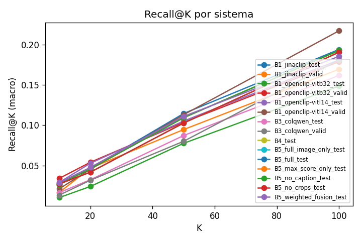

# Multimodal Visual Information Retrieval of Traditional Portuguese Instruments

<p class="subtitle">
A reproducible comparison of dense retrieval, late interaction, VLM reranking, and agentic reranking.
</p>

<p class="meta">
Traditional Portuguese Instruments IR · GPU full run on esalab-big · 2026-06-30
</p>

---

## Talk Map

1. Motivation and retrieval task
2. Dataset, privacy, and leakage controls
3. Systems compared
4. Reproducible GPU setup
5. Results and reranking analysis
6. Limitations and next steps

---

## Motivation

Visual archives often need retrieval by semantic instrument names, not by filenames or manual tags.

<div class="callout">
Given a query such as <strong>adufe</strong>, rank images that visibly contain that traditional instrument.
</div>

- Instrument categories are visually fine-grained and often small in the frame.
- Several viola variants are visually close to each other.
- The evaluation must not leak filenames, video identifiers, or labels into inference.

---

## IR Formulation

<div class="two-col">

<div>

### Query side

- 22 instrument classes
- 3 query languages per class
- 66 test queries
- Text-only query input

</div>

<div>

### Document side

- Candidate image frames
- Multi-label COCO ground truth
- Anonymous `image_id`
- Relevance = instrument is present

</div>

</div>

---

## Dataset

<div class="metric-grid">
  <div class="metric">
    <div class="label">Train</div>
    <div class="value">3,954</div>
    <div class="note">images</div>
  </div>
  <div class="metric">
    <div class="label">Valid</div>
    <div class="value">1,351</div>
    <div class="note">images</div>
  </div>
  <div class="metric">
    <div class="label">Test</div>
    <div class="value">1,317</div>
    <div class="note">images</div>
  </div>
  <div class="metric">
    <div class="label">Classes</div>
    <div class="value">22</div>
    <div class="note">instrument labels</div>
  </div>
</div>

<br>

Source dataset: Mendeley DOI `10.17632/pk7txkgt4v.2`.

---

## Leakage Controls

- Public retrieval corpus contains `image_id`, split, width, and height.
- Private mapping resolves pixels only inside `ImageProvider`.
- Prompts and traces do not expose filename, Vimeo id, or labels.
- Tests cover runfile format, qrels, reporting, and no-filename leakage.

```text
query text + anonymous image_id -> model inference -> ranked image_id list
private filename/labels -> qrels/evaluation only
```

---

## Systems Compared

<div class="pipeline">
  <div class="stage">
    <strong>B1 Dense</strong>
    <p>OpenCLIP ViT-B/32, OpenCLIP ViT-L/14, JinaCLIP.</p>
  </div>
  <div class="stage">
    <strong>B3 Late Interaction</strong>
    <p>ColQwen multivector image/text scoring.</p>
  </div>
  <div class="stage">
    <strong>B4 VLM Reranker</strong>
    <p>Dense top-200 candidates reranked pointwise by Qwen2.5-VL.</p>
  </div>
  <div class="stage">
    <strong>B5 Agentic Reranker</strong>
    <p>Full image VQA, optional captions, deterministic crops, evidence fusion.</p>
  </div>
</div>

---

## GPU Run Configuration

<div class="two-col">

<div>

### Hardware and containers

- Server: `esalab-big`
- GPU: RTX 3090 Ti, 24 GB
- Docker Compose GPU pipeline
- vLLM image: `vllm/vllm-openai:v0.10.1.1`

</div>

<div>

### VLM settings

- Model: `Qwen/Qwen2.5-VL-3B-Instruct`
- Served as: `qwen2.5-vl`
- `max_model_len=4096`
- `VLM_MAX_IMAGE_SIDE=768`
- `VLM_WORKERS=8`
- Persistent VLM cache enabled

</div>

</div>

---

## Reproducibility Artifacts

The full snapshot is versioned in:

```text
results/esalab-big/2026-06-30_gpu_full/
```

- `outputs/runs/`: TREC runfiles
- `outputs/metrics/`: JSON metrics
- `outputs/rerank_traces/`: B4/B5 decision traces
- `outputs/reports/final_report.md`: generated report
- `outputs/remote/gpu_full.log`: remote execution log

---

## Main Test Results

<div class="compact-table">

| system | recall@100 | ndcg@100 | map | mrr |
|---|---:|---:|---:|---:|
| B1_openclip-vitb32_test | 0.1485 | 0.2007 | 0.0514 | 0.2251 |
| B1_openclip-vitl14_test | 0.1808 | 0.2456 | 0.0760 | 0.3438 |
| B1_jinaclip_test | **0.1938** | **0.2640** | **0.0842** | 0.3282 |
| B3_colqwen_test | 0.1617 | 0.2268 | 0.0705 | 0.3043 |
| B4_test | 0.1904 | 0.2553 | 0.0764 | 0.3777 |
| B5_full_test | 0.1926 | 0.2639 | 0.0795 | **0.4229** |
| B5_weighted_fusion_test | 0.1853 | 0.2597 | 0.0787 | 0.3885 |

</div>

<p class="small">Macro averages over instrument queries. Full table is in the result snapshot.</p>

---

## Recall at K



---

## Reranking Gain

<div class="compact-table">

| system | candidate_recall@200 | oracle_recall@100 | rerank_gain@100 | delta_ndcg@100 | delta_map |
|---|---:|---:|---:|---:|---:|
| B4_test | 0.2938 | 0.2781 | +0.0096 | +0.0097 | -0.0309 |
| B5_full_test | 0.2938 | 0.2781 | +0.0118 | +0.0183 | -0.0278 |

</div>

<br>

<div class="callout">
B4/B5 can only rerank what the dense stage retrieves. Candidate recall at top-200 sets the ceiling.
</div>

---

## B5 Ablations

<div class="compact-table">

| variant | recall@100 | ndcg@100 | map | mrr |
|---|---:|---:|---:|---:|
| full | 0.1926 | 0.2639 | 0.0795 | 0.4229 |
| no_crops | 0.1904 | 0.2553 | 0.0764 | 0.3777 |
| no_caption | 0.1926 | 0.2639 | 0.0795 | 0.4229 |
| full_image_only | 0.1904 | 0.2553 | 0.0764 | 0.3777 |
| max_score_only | 0.1926 | 0.2639 | 0.0795 | 0.4229 |
| weighted_fusion | 0.1853 | 0.2597 | 0.0787 | 0.3885 |

</div>

---

## What Improved?

- B5 full improves MRR most clearly: `0.4229` vs `0.3282` for JinaCLIP.
- B5 full gives the best reranking gain among B4/B5: `+0.0118` recall@100.
- JinaCLIP remains the strongest single dense model on recall@100 and MAP.
- Weighted fusion improves nDCG@10 but hurts recall@100 in this run.

---

## Per-class Observations

- `viola-beiroa`: B4/full-image reranking is strongest at recall@100.
- `flauta`: ColQwen is strongest, suggesting patch-level matching helps.
- `cavaquinho`: B5 full is strongest among test systems.
- Rare classes such as `matracas`, `palheta`, and `sarronca` remain difficult.

---

## Operational Notes

- Full run completed with exit code `0`.
- B4 and every B5 ablation processed `13,200 / 13,200` candidates.
- vLLM was stopped after result collection to release GPU memory.
- Local tests pass: `28 passed`.

---

## Limitations

- VLM reranking is bounded by dense candidate recall.
- The dataset has 22 classes, so per-class variance can be high.
- Some instrument variants are visually similar and may need domain-specific visual cues.
- Qwen-VL context limits require controlled image resizing for stable vLLM serving.

---

## Takeaways

1. Dense retrieval remains competitive and cheap.
2. VLM reranking improves ordering quality, especially MRR and nDCG.
3. Agentic B5 adds value over plain B4, but only modestly under the current candidate ceiling.
4. The full run is reproducible and packaged with runfiles, metrics, traces, reports, logs, and slides.

---

## Appendix: Run Commands

```bash
export VLM_MODEL_HF=Qwen/Qwen2.5-VL-3B-Instruct
export VLLM_IMAGE=vllm/vllm-openai:v0.10.1.1
export VLLM_MAX_MODEL_LEN=4096
export VLLM_GPU_MEMORY_UTILIZATION=0.60
export VLM_MAX_IMAGE_SIDE=768
export VLM_WORKERS=8
export VLM_CACHE=1

docker compose -f docker/docker-compose.gpu.yml up -d vlm-server
docker compose -f docker/docker-compose.gpu.yml run --rm irlab bash scripts/gpu_full.sh
```

---

## Appendix: Slidev

```bash
cd slides/slidev
npm install
npm run dev
npm run build
npm run export
```
