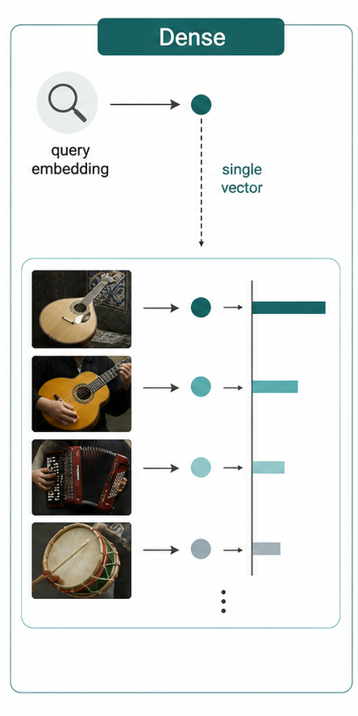
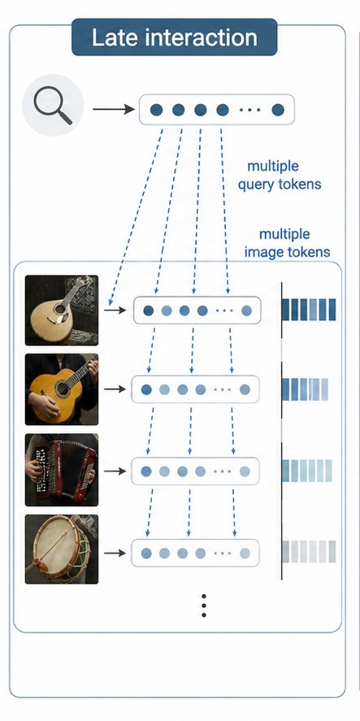
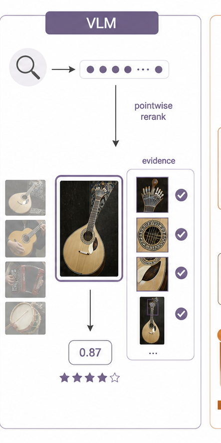
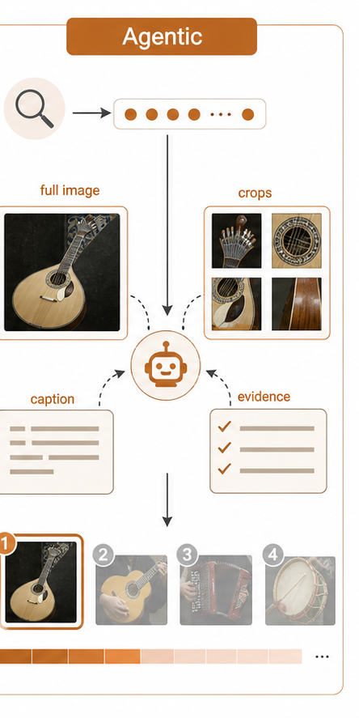

# Multimodal Visual Retrieval of Traditional Portuguese Musical Instruments

Dense, VLM, and Agentic Reranking — a reproducible comparison on a labelled visual corpus.

Adrian Valera Roman · Álvaro Lozano Murciego · María N. Moreno García 
adrianvalrom.usal@usal.es · loza@usal.es · mmg@usal.es

---

## Índice de contenidos

1. Motivación y formulación como recuperación visual
2. Corpus anotado y control de fugas de información
3. Sistemas evaluados
4. Diseño experimental y reproducibilidad
5. Resultados: recall, calidad y **significancia estadística**
6. Análisis por instrumento y coste temporal
7. Conclusiones y futuras líneas de trabajo

Estructura revisada: se añaden significancia estadística, techo de candidatos, ablaciones, análisis por instrumento y limitaciones.

---

## Motivación

La recuperación de información permite explorar grandes corpus culturales sin revisar manualmente cada vídeo, imagen o documento. En archivos audiovisuales, una consulta útil no suele ser un identificador técnico, sino una necesidad semántica:

Encontrar fragmentos visuales donde aparece un instrumento tradicional concreto, aunque el vídeo no esté etiquetado con ese instrumento.

El mapa de A Música Portuguesa a Gostar Dela Própria reúne numerosos vídeos de música tradicional portuguesa. En ese tipo de archivo, la pregunta de IR sería: dado un instrumento, ¿qué frames o vídeos deberían aparecer primero?

A Música Portuguesa a Gostar Dela Própria, “Mapa,” accessed Jun. 2026. 
https://amusicaportuguesaagostardelapropria.org/map

---

## Del archivo al corpus evaluable

  
  

---

## Dataset

  

    
Train

    
3,954

    
imágenes

  

  

    
Valid

    
1,351

    
imágenes

  

  

    
Test

    
1,317

    
imágenes

  

  

    
Clases

    
22

    
instrumentos

  

  

---

## Caso de estudio: formulación IR

---

## Relevancia y control de información

  
Consulta <strong>“adufe”</strong>

  
→

  
Frame <strong>imagen</strong>

  
→

  
Modelo <strong>score</strong>

  
→

  
Ranking <strong>image_id</strong>

Consulta textual + imagen del frame.

---

## Setup experimental y reproducibilidad

  

Split de evaluación

test — 1,317 imágenes, 66 consultas

  

Dense base (candidatos)

OpenCLIP ViT-L/14

  

Determinismo

seed = 42 · temperature = 0.0

  

Profundidad de candidatos

top-200 (B4/B5) · top-100 (Qwen3.6)

  

Serving VLM

vLLM (Qwen2.5-VL-3B) · llama.cpp (Qwen3.6-27B)

  

Reproducibilidad

Docker GPU · git commit · DVC · MLflow

---

## Sistemas evaluados

Cuatro familias: Dense (embeddings globales), Late-interaction, VLM-rerank multimodal y búsqueda Agéntica.

---

## Sistema 1: Recuperación densa

Los modelos densos proyectan la consulta y cada imagen a un espacio vectorial común. El ranking se obtiene por similitud entre vectores.

- Un embedding por consulta, un embedding por imagen.
- Muy eficiente para indexar y recuperar a gran escala.
- Limitación: puede perder detalles pequeños o instrumentos visualmente parecidos.

**Sistemas evaluados**

- OpenCLIP ViT-B/32
- OpenCLIP ViT-L/14
- JinaCLIP

---

## Sistema 2: interacción tardía

ColQwen representa la imagen y la consulta mediante múltiples vectores. En lugar de comparar un único embedding global, calcula coincidencias entre tokens visuales y textuales (late interaction).

- Mejor sensibilidad a partes locales de la imagen.
- Útil cuando el instrumento ocupa una zona pequeña.
- Más costoso que un índice denso global.

Especialmente interesante para instrumentos que aparecen parcialmente o entre otros objetos.

---

## Sistema 3: reranking multimodal

El reranking multimodal parte de una lista candidata generada por recuperación densa. Un VLM examina cada imagen candidata y decide si el instrumento está presente.

- El VLM no busca en todo el corpus: solo reordena candidatos.
- Produce una decisión y una confianzad.
- Modelo base: Qwen2.5-VL-3B; se compara además con Qwen3.6-27B.
- Puede incorporar evidencia visual explícita.

La calidad final está acotada por el techo de los candidatos recuperados inicialmente.

---

## Sistema 4: búsqueda agéntica

Añade una estrategia de inspección visual sobre el reranking multimodal, como grafo determinista propio:

- Primero pregunta por la imagen completa.
- Si hay incertidumbre, genera recortes deterministas.
- Puede producir una breve descripción (caption).
- Fusiona evidencias para el score final.

El objetivo es mirar de forma controlada cuando la imagen completa no basta.

---

## Diseño experimental

La evaluación compara sistemas sobre las mismas consultas y el mismo split de test:

- 22 instrumentos · 3 idiomas · 66 consultas.
- Mismo dense base (OpenCLIP L/14) para todos los rerankers.
- Métricas macro por consulta/instrumento.

El protocolo separa dos fases:

- Recuperación inicial: ranking directo sobre el corpus.
- Reranking: reordenación de candidatos ya recuperados.

Esto distingue entre capacidad de <em>encontrar</em> candidatos y capacidad de <em>ordenar</em> los encontrados.

---

## Resultados: Recall@K

JinaCLIP mantiene el mejor Recall@100 entre los sistemas de recuperación directa. Qwen3.6 top-100 recupera el techo del candidato denso y mejora la ordenación temprana dentro de ese conjunto.

---

## Resultados: calidad del ranking

Qwen3.6 top-100 obtiene el mejor nDCG@10, mAP y MRR de la comparación. La búsqueda agéntica mantiene una ligera ventaja de cobertura frente al candidato denso usado por Qwen.

---

## Resultados: tabla macro y significancia estadística

| Sistema (código) | R@20 | R@50 | R@100 | nDCG@10 | nDCG@100 | mAP | MRR |
|---|---|---|---|---|---|---|---|
| OpenCLIP B/32 (B1) | 0.024 | 0.078 | 0.148 | 0.156 | 0.201 | 0.051 | 0.225 |
| OpenCLIP L/14 (B1) | 0.053 | 0.105 | 0.181 | 0.250 | 0.246 | 0.076 | 0.344 |
| JinaCLIP (B1) | 0.047 | **0.114** | **0.194** | 0.252 | 0.264 | 0.084 | 0.328 |
| ColQwen (B3) | 0.033 | 0.087 | 0.162 | 0.197 | 0.227 | 0.070 | 0.304 |
| VLM-rerank 3B (B4) | 0.042 | 0.103 | 0.190 | 0.260 | 0.255 | 0.076 | 0.378 |
| Agéntico (B5) | 0.046 | 0.109 | 0.193 | 0.262 | 0.264 | 0.080 | 0.423 |
| **Qwen3.6-27B (B4·27B)** | **0.063** | 0.111 | 0.181 | **0.389** | **0.272** | **0.088** | **0.495** |

| Comparación (delta) | nDCG@10 | mAP | MRR | Recall@100 |
|---|---|---|---|---|
| JinaCLIP vs OpenCLIP L/14 | +0.002 | +0.008 | −0.016 | +0.013 |
| ColQwen vs OpenCLIP L/14 | −0.053 | −0.006 | −0.039 | −0.019 |
| VLM-rerank 3B vs OpenCLIP L/14 | +0.010 | +0.000 | +0.034 | +0.010 |
| Agéntico vs VLM-rerank 3B | +0.002 | +0.003 | +0.045 | +0.002 |
| **Qwen3.6-27B vs OpenCLIP L/14** | **+0.138 ✅** | **+0.012 ✅** | **+0.151 ✅** | +0.000 |
| **Qwen3.6-27B vs VLM-rerank 3B** | **+0.128 ✅** | **+0.012 ✅** | **+0.118 ✅** | −0.010 |

---

## Lectura de los resultados

| Enfoque | Lectura principal |
|---|---|
| Dense retrieval | Muy competitivo y barato; JinaCLIP lidera Recall@100 y mAP. |
| Late interaction | No mejora sobre dense base en promedio, pero ayuda en clases con señales locales. |
| VLM reranking | Mejora la ordenación de los candidatos, especialmente nDCG/MRR, pero sin mejora significativa. |
| Qwen3.6 top-100 | Mejora las primeras posiciones y mAP; no añade cobertura fuera del candidato denso. |
| Agéntico | Añade valor cuando la inspección completa no basta, pero aumenta el coste. |

El cuello de botella no es el razonamiento visual, sino que la primera etapa recupere suficientes candidatos relevantes.

---

## Análisis por instrumento

<strong>Recall@100 por clase:</strong>

- Fáciles: viola-beiroa 0.76, concertina 0.49, caixa-tamboril 0.38.
- Difíciles: violão 0.08, viola-braguesa 0.13.
- Fallo total 0.00: matracas, palheta, sarronca, reque-reque.

Ningún sistema domina: el mejor por clase se reparte entre dense, late-interaction, VLM-rerank y agéntico.

<strong>Error analysis (ej. adufe):</strong>

- 8 falsos positivos en top-100.
- 150 relevantes no recuperados (fuera del top-100).

---

## Coste temporal por consulta

La comparación temporal debe leerse como parte del diseño del sistema:

- OpenCLIP L/14: 0.019 s/consulta; JinaCLIP: 0.104 s/consulta.
- ColQwen: 0.479 s/consulta con embeddings cacheados.
- VLM-rerank 3B: 30.1 s/consulta; agéntico: 44.9 s/consulta.
- Qwen3.6-27B: 129.3 s/consulta incremental para candidatos 51-100; top-100 desde cero se estima en 284.2 s/consulta.
- B5 tiene una cola más larga por recortes, captions y llamadas adicionales.

El reranking cuesta ~1,600–2,500× más que el dense para una mejora de ordenación acotada por el techo.

---

## Conclusiones

- La tarea es útil para **explorar archivos audiovisuales de patrimonio musical** cuando el usuario busca por instrumentos, no por metadatos técnicos.
- Un **dataset anotado** convierte el corpus en un banco de pruebas cuantitativo para sistemas de IR visual.
- Los **modelos densos** son una base sólida y eficiente.
- Los VLMs y la búsqueda agéntica aportan **mejoras de ordenación**; Qwen3.6 lo confirma en top-100 con el mejor nDCG@10, mAP y MRR, aunque con mayor coste temporal.
- Con n=66, un VLM grande (Qwen3.6-27B) produce **mejoras de ordenación estadísticamente significativas** (nDCG@10 +0.14, mAP +0.012, MRR +0.15; Holm p&lt;0.05).
- El **coste temporal** debe considerarse junto a la métrica: el mejor ranking no siempre es el sistema más operativo.

---

## Futuras líneas de trabajo

- **Escalar Qwen3.6-27B a top-200** y bajo el mismo entorno GPU/serving para separar calidad del modelo, profundidad y coste.
- **Mejorar la primera etapa** (el verdadero cuello de botella): dense fine-tuning o fusión de retrievers para subir el techo de candidatos.
- **Medir latencia completa por query** para todos los enfoques con cachés y hardware controlados.
- Llevar la evaluación de frames a **recuperación de vídeos completos**.
- Integrar **señales temporales**: múltiples frames, audio y contexto de actuación.
- **Conocimiento previo**: los modelos fundacionales pueden haber visto instrumentos comunes; se prioriza open-weight y ejecución offline para acotarlo.

---

## Bibliografía

[1] A Música Portuguesa a Gostar Dela Própria, “Mapa,” accessed Jun. 30, 2026. [Online]. Available: https://amusicaportuguesaagostardelapropria.org/map

[2] N. Zendron <em>et al.</em>, “Comprehensive dataset of Portuguese folk instruments for computer vision and heritage research,” <em>Data in Brief</em>, vol. 61, Art. no. 111739, 2025, doi: 10.1016/j.dib.2025.111739.

[3] N. Zendron <em>et al.</em>, “Portuguese folk instruments dataset,” Mendeley Data, V2, 2025, doi: 10.17632/pk7txkgt4v.2.

[4] A. Radford <em>et al.</em>, “Learning transferable visual models from natural language supervision,” in <em>Proc. ICML</em>, 2021.

[5] G. Ilharco, M. Wortsman, R. Wightman, C. Gordon, N. Carlini, R. Taori, A. Dave, V. Shankar, H. Namkoong, J. Miller, H. Hajishirzi, A. Farhadi, and L. Schmidt, “OpenCLIP,” Zenodo, 2021, doi: 10.5281/zenodo.5143773.

[6] Jina AI, “Jina CLIP: Your CLIP model is also your text retriever,” arXiv:2405.20204, 2024.

[7] M. Faysse <em>et al.</em>, “ColPali: Efficient document retrieval with vision language models,” arXiv:2407.01449, 2024.

[8] P. Wang <em>et al.</em>, “Qwen2-VL: Enhancing vision-language model's perception of the world at any resolution,” arXiv:2409.12191, 2024.

[9] Qwen Team, “Qwen2.5-VL technical report,” arXiv:2502.13923, 2025.

[10] T. Yao <em>et al.</em>, “ReAct: Synergizing reasoning and acting in language models,” in <em>Proc. ICLR</em>, 2023.

[11] G. Gerganov, “llama.cpp,” GitHub repository, 2023. [Online]. Available: https://github.com/ggml-org/llama.cpp

[12] Unsloth, “Qwen3.6-27B-GGUF,” Hugging Face model card, accessed Jun. 30, 2026. [Online]. Available: https://huggingface.co/unsloth/Qwen3.6-27B-GGUF

